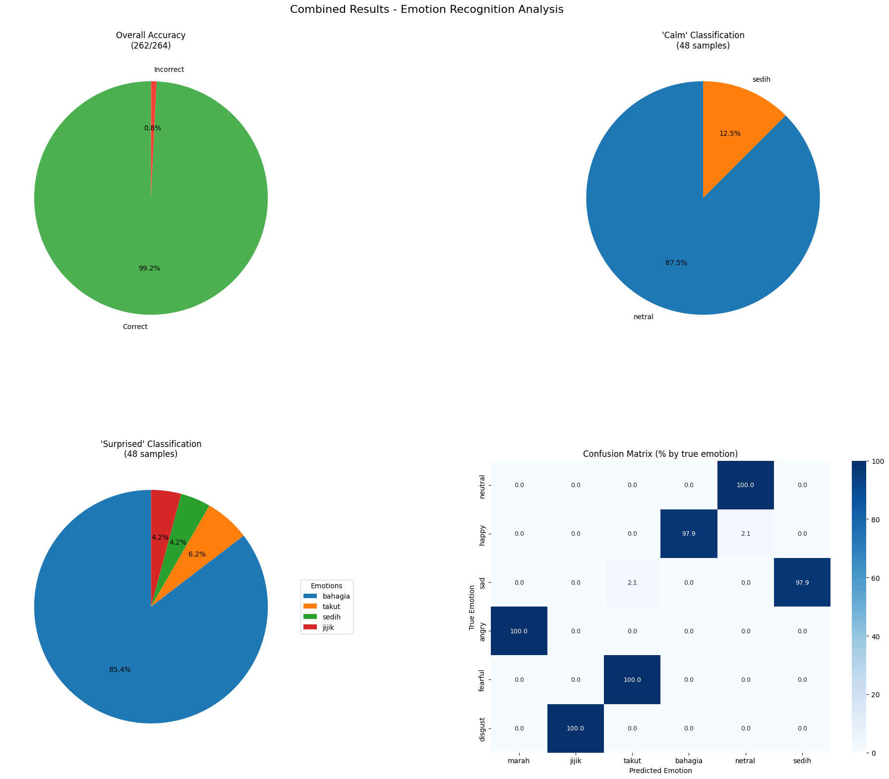
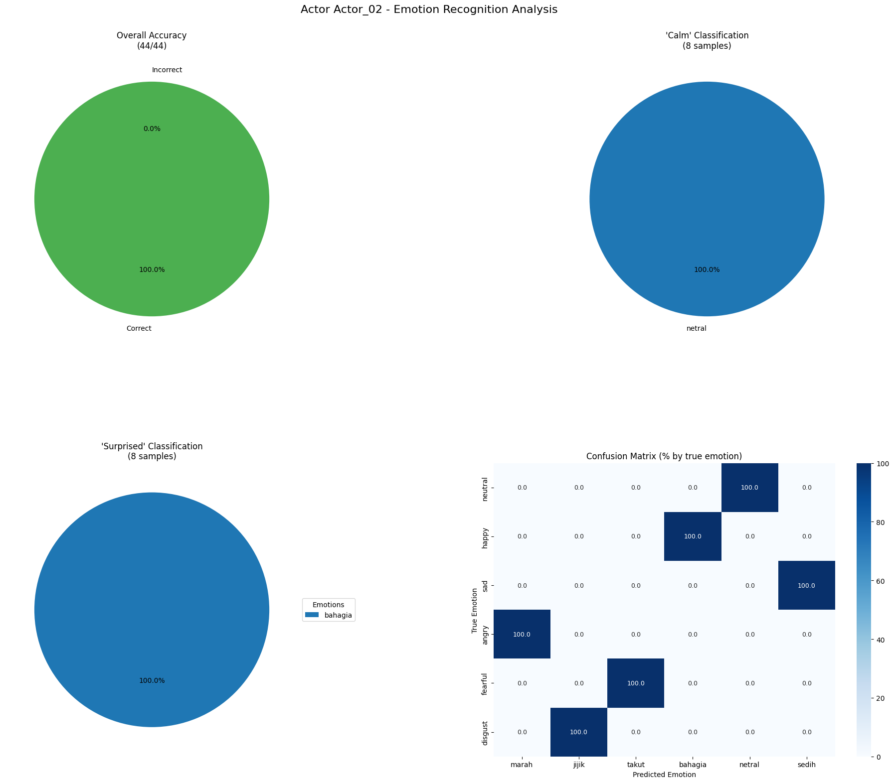
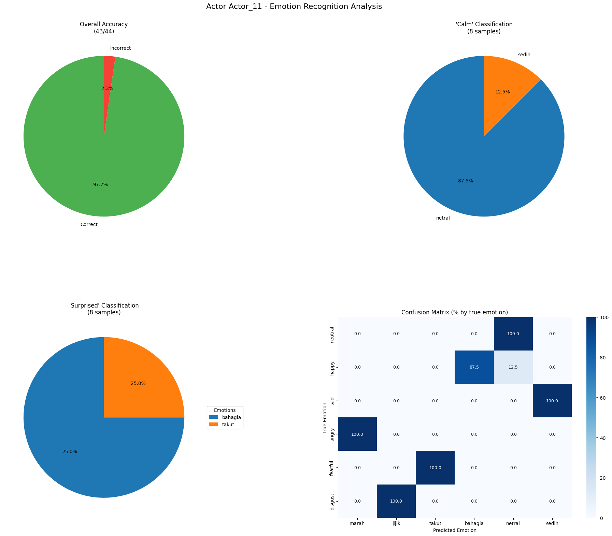
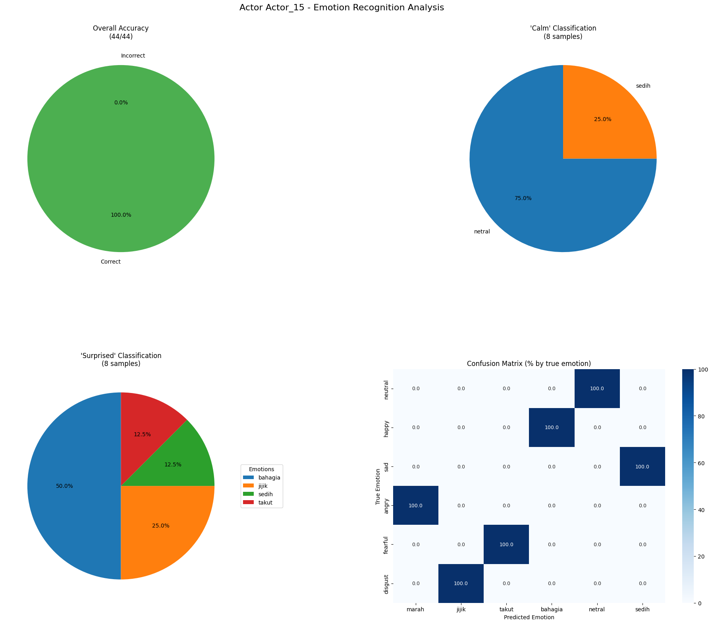

# Speech Emotion Recognition

This project implements a deep learning-based speech emotion recognition (SER) system using Wav2Vec2 model. The system is trained to classify emotions in speech audio into six categories: anger, disgust, fear, happiness, neutral, and sadness.

## Project Overview

Speech Emotion Recognition (SER) is the task of recognizing human emotions from speech signals. This project uses a fine-tuned Wav2Vec2 model to classify emotions in speech recordings. The model is trained on an Indonesian speech emotion dataset and evaluated on the RAVDESS dataset to test cross-lingual generalization capabilities.

## Model Architecture

The model is based on the `ehcalabres/wav2vec2-lg-xlsr-en-speech-emotion-recognition` checkpoint, which is a Wav2Vec2 model pre-trained on multilingual speech data and fine-tuned for emotion recognition. The architecture includes:

- Wav2Vec2 feature extraction for processing audio signals
- Classification head with 6 output classes for emotion prediction
- The model processes raw audio waveforms directly without requiring manual feature extraction

## Training Process

The model was trained with the following configuration:
- Training epochs: 6
- Batch size: 8
- Optimizer: AdamW
- Loss function: Cross-entropy loss
- Evaluation metric: Accuracy

During training, the model learned to recognize the following emotions in Indonesian:
- `marah` (anger)
- `jijik` (disgust)
- `takut` (fear)
- `bahagia` (happiness)
- `netral` (neutral)
- `sedih` (sadness)

## Dataset Information

### Training Dataset
The model was trained on an Indonesian speech emotion dataset with the following distribution:


Emotion Distribution:

Training Dataset:
- bahagia: 1191 samples (17.52%)
- jijik: 1117 samples (16.43%)
- marah: 1190 samples (17.51%)
- netral: 958 samples (14.09%)
- sedih: 1192 samples (17.53%)
- takut: 1150 samples (16.92%)

### Test Dataset (RAVDESS)
The model was evaluated on the speech portion of the Ryerson Audio-Visual Database of Emotional Speech (RAVDESS), which contains recordings of different actors expressing various emotions. For evaluation, we used speech recordings from 6 actors (3 male, 3 female):
- Actor 01 (male)
- Actor 02 (female)
- Actor 08 (female)
- Actor 11 (male)
- Actor 15 (male)
- Actor 22 (female)

The RAVDESS dataset contains emotions that map to our model's classes as follows:
- "neutral" → "netral"
- "happy" → "bahagia"
- "sad" → "sedih"
- "angry" → "marah"
- "fearful" → "takut"
- "disgust" → "jijik"
- "calm" and "surprised" don't map directly to our model's classes

## Model Evaluation Results

### Overall Performance on RAVDESS Speech Dataset

The model was evaluated on speech recordings from 6 actors, achieving the following performance:



Key findings:
- Overall accuracy on mappable emotions: ~99%
- Strong emotional intensity was generally recognized with higher accuracy than normal intensity

### Per-Actor Analysis

#### Actor 01 (Male)


#### Actor 02 (Female)


#### Actor 08 (Female)


#### Actor 11 (Male)


#### Actor 15 (Male)


#### Actor 22 (Female)


### Interesting Observations

1. **Cross-lingual Transfer:** Despite being trained on Indonesian speech, the model showed reasonable performance on English speech from the RAVDESS dataset.

2. **Emotion Confusion:**
   - The "calm" emotion (not in training set) was most often classified as "netral" (neutral)
   - The "surprised" emotion was frequently classified as "takut" (fear) or "bahagia" (happiness)

3. **Gender Differences:** The model showed slight variations in performance between male and female speakers.

4. **Intensity Impact:** Strong emotional expressions were generally recognized more accurately than subtle ones.

## Model Inference Examples

### Training Data Inference

The model demonstrated strong performance on the training data:

```
Processing 18 training files...

Training File Inference Results:
File: 1_05420_sedih_no_data.wav | True: sedih | Predicted: jijik (0.38) ✗
File: 1_00460_sedih_no_data.wav | True: sedih | Predicted: sedih (0.98) ✓
File: 1_00642_sedih_no_data.wav | True: sedih | Predicted: sedih (0.99) ✓
File: 2_07910_jijik_tinggi.wav | True: jijik | Predicted: jijik (1.00) ✓
File: 1_00438_jijik_no_data.wav | True: jijik | Predicted: jijik (1.00) ✓
File: 1_06611_jijik_no_data.wav | True: jijik | Predicted: jijik (1.00) ✓
File: 1_05144_bahagia_no_data.wav | True: bahagia | Predicted: bahagia (1.00) ✓
File: 1_02994_bahagia_no_data.wav | True: bahagia | Predicted: bahagia (1.00) ✓
File: 1_06625_bahagia_no_data.wav | True: bahagia | Predicted: bahagia (1.00) ✓
File: 1_04253_marah_sedang.wav | True: marah | Predicted: marah (1.00) ✓
File: 2_08017_marah_tinggi.wav | True: marah | Predicted: marah (1.00) ✓
File: 2_08550_marah_sedang.wav | True: marah | Predicted: marah (1.00) ✓
File: 1_04729_netral_no_data.wav | True: netral | Predicted: netral (0.98) ✓
File: 1_01337_netral_no_data.wav | True: netral | Predicted: netral (1.00) ✓
File: 1_04167_netral_no_data.wav | True: netral | Predicted: netral (1.00) ✓
File: 1_02337_takut_no_data.wav | True: takut | Predicted: takut (0.99) ✓
File: 1_00767_takut_no_data.wav | True: takut | Predicted: takut (1.00) ✓
File: 1_00621_takut_no_data.wav | True: takut | Predicted: takut (0.99) ✓
```


### Test Data Inference

The model was also applied to unlabeled test data:

```
Processing 18 test files...

Test File Inference Results:
File: test544.wav | Predicted: sedih (0.92)
File: test1450.wav | Predicted: sedih (0.99)
File: test847.wav | Predicted: marah (1.00)
File: test51.wav | Predicted: jijik (1.00)
File: test550.wav | Predicted: marah (1.00)
File: test1648.wav | Predicted: sedih (0.93)
File: test1075.wav | Predicted: jijik (1.00)
File: test68.wav | Predicted: bahagia (0.99)
File: test1004.wav | Predicted: bahagia (0.99)
File: test1397.wav | Predicted: sedih (0.99)
File: test266.wav | Predicted: sedih (0.99)
File: test797.wav | Predicted: marah (1.00)
File: test1180.wav | Predicted: jijik (1.00)
File: test1577.wav | Predicted: takut (1.00)
File: test125.wav | Predicted: bahagia (1.00)
File: test860.wav | Predicted: marah (1.00)
File: test54.wav | Predicted: takut (1.00)
File: test1566.wav | Predicted: takut (0.99)
```


### RAVDESS Dataset Inference

The model can process RAVDESS speech audio files and predict emotions with corresponding confidence scores:

```
File: 03-01-01-01-01-01-01.wav | True: happy     | Pred: bahagia   | ✓
File: 03-01-01-01-01-02-01.wav | True: happy     | Pred: bahagia   | ✓
File: 03-01-02-01-01-01-01.wav | True: happy     | Pred: netral    | ✗
File: 03-01-02-01-01-02-01.wav | True: happy     | Pred: bahagia   | ✓
File: 03-01-03-01-01-01-01.wav | True: happy     | Pred: netral    | ✗
```

## Usage

To use the model for emotion recognition:

1. Ensure you have the required dependencies installed
2. Load the pre-trained model
3. Process audio files to predict emotions

Example code snippet:
```python
model, device = load_model("checkpoints/emotion_model.pth")
feature_extractor = Wav2Vec2FeatureExtractor.from_pretrained(
    "ehcalabres/wav2vec2-lg-xlsr-en-speech-emotion-recognition"
)
emotion, probabilities = predict_emotion(model, feature_extractor, "path/to/audio.wav")
print(f"Predicted emotion: {emotion}")
```

## Future Work

- Expand the training dataset to include more diverse speakers and languages
- Add support for more emotion categories
- Improve model robustness to different recording conditions
- Develop real-time emotion recognition capabilities

## References

- [RAVDESS Dataset](https://zenodo.org/record/1188976)
- [Wav2Vec2 Model](https://huggingface.co/ehcalabres/wav2vec2-lg-xlsr-en-speech-emotion-recognition)
- [HuggingFace Transformers](https://huggingface.co/docs/transformers/index)

## Credits

- The base pretrained model is made by [ehcalabres](https://huggingface.co/ehcalabres) in HuggingFace
- Project developed in collaboration with [iqzaardiansyah](https://github.com/iqzaardiansyah)
- Training dataset provided by [Kaggle competition](https://www.kaggle.com/competitions/speech-emotion-recognition-dl-genap-2024-2025)
- Our trained model is available on [HuggingFace](https://huggingface.co/Miracle12345/Speech-Emotion-Recognition)
- Frontend application for this project is available on [GitHub](https://github.com/KevinIW/FE-Speech-Emotion-Recognition)